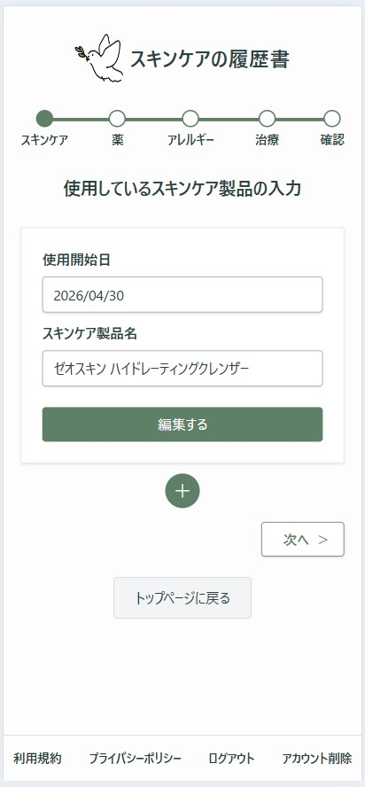
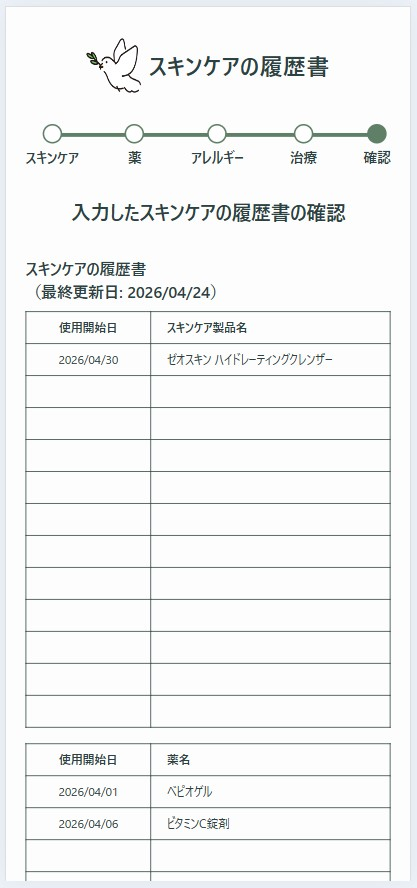

# スキンケアの履歴書

## サービス概要

- 皮膚科の問診や診察の場で、使用しているスキンケアや薬、これまでの治療履歴を  
  思い出して説明する負担を減らし、正確な情報を伝えられるようにするためのアプリです。

- 日々のスキンケアや治療の記録を一つにまとめ、医師にそのまま見せられます。

## 特徴

- 登録なしにすぐに入力を始められます
- 入力した履歴書を保存したい場合はログインが必要です
- 保存した履歴書はいつでも見返せます
- 登録に関わらず、入力した履歴書を印刷することができます

## 操作手順

- Google ログインあり

1. Google アカウントでログイン(任意)
2. スキンケア / 薬 / アレルギー / 治療履歴を入力する
3. 入力した履歴書内容を確認・印刷

- Google ログインなし

1. スキンケア / 薬 / アレルギー / 治療履歴を入力する
2. 保存する(保存時に Google ログインします)
3. 入力した履歴書内容を確認・印刷

<p align="center">
  
  
</p>

## 技術スタック

- Ruby 3.3.0 Ruby on Rails 8.0.4 Hotwire
- PostgreSQL 16.9

## 環境構築

1. 任意のディレクトリにこのリポジトリのクローンを保存します。

```
git clone https://github.com/sjabcdefin/skincare-resume.git
```

2. リポジトリに移動します。

```
cd skincare-resume
```

3. セットアップを実行します。

```
bin/setup
```

4. Google Cloud で Google ログインに必要な `client_id` と `client_secret` を取得し、`.env` ファイルに設定します。

- `.env`ファイルを作成します。`.env` は環境変数を管理するファイルです（gitには含めません）。

```
touch .env
```

- Google Cloud で取得した `client_id` と` client_secret` を `.env`ファイルに設定します。

```
OMNIAUTH_CLIENT_ID=取得したclient_id
OMNIAUTH_CLIENT_SECRET=取得したclient_secret
```

5. 定期削除処理失敗時のメールアドレスを設定します。

- `.env`ファイルに任意の送信先/送信元メールアドレス(Gmail)を設定します。

```
ALERT_EMAIL_ADDRESS=送信先メールアドレス
MAIL_FROM_ADDRESS=送信元メールアドレス
```

6. アプリを起動します。

```
bin/rails server
```

## テスト

```
bin/rails test:all
```

## Lint

```
bin/lint
```
